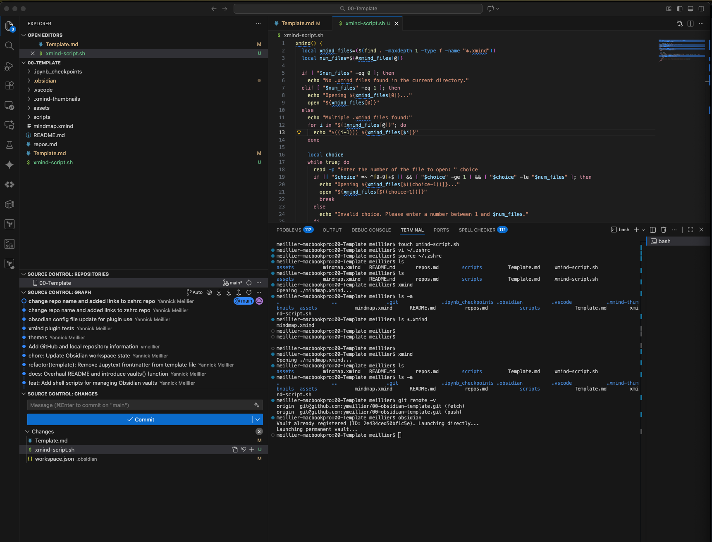

created script for xmind files.

This repository contains the .obsidian config directory used as our reference obsidian configurations when creating a new permanent or temporary vault with the `obsidian` or `obsidian_tmp` commands.

Repo: [https://github.com/ymeillier/00-obsidian-template](https://github.com/ymeillier/00-obsidian-template)

[Template.md](./Template.md) covers configurations, plugins, and customization configured on our template vault. 

See:

# Markdown Syntax Refreshers

## xmind via Xmind Linker

To show the view of a mindmap created with xmind in our markdown note.

With an Xmind mindmap `mindmap.xmind`:

and in the xmind application:

in the note use the standard embedding syntax:

![[mindmap.xmind]]

