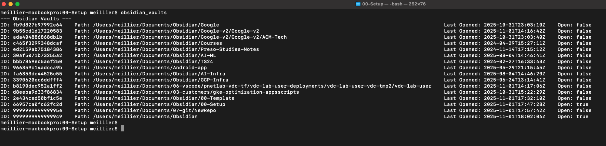
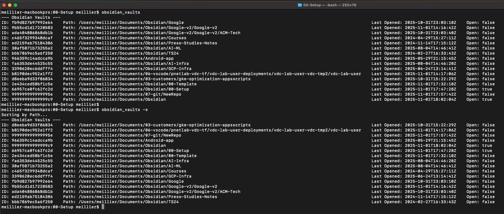
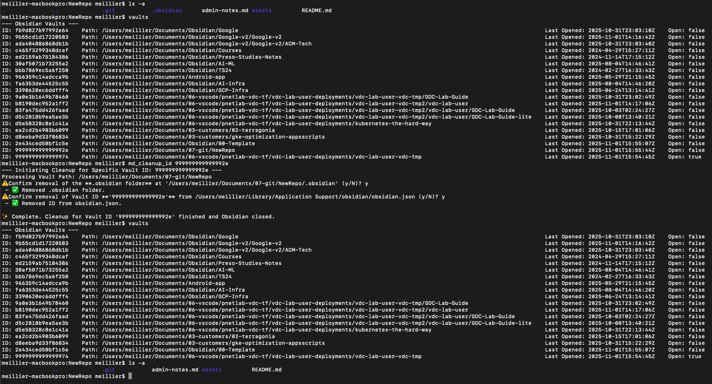
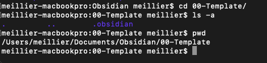
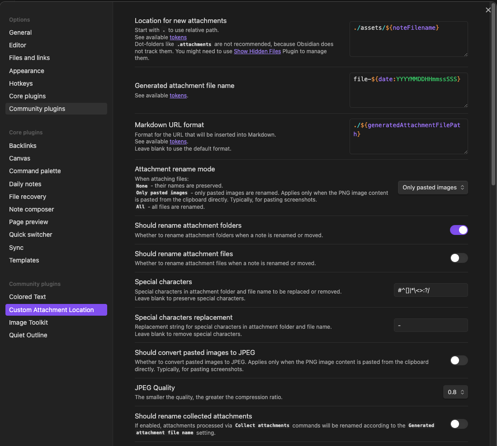

This repository contains the .obsidian config directory used as our reference obsidian configurations when creating a new permanentt or temporary vault with the `obsidian` or `obsidian_tmp` commands.

See [https://github.com/ymeillier/043-obsidian-setup/blob/main/README.md](https://github.com/ymeillier/043-obsidian-setup/blob/main/README.md) for our Obsidian workflow.

[Template.md](./Template.md) covers configurations, plugins, and customization configured on our template vault. 


----------------------------

This repo describes the custom bash scripts used to customize our workflow of using Obsidian as our markdown editor.

I personally needed to use Obsidian to open md files without necessarily creating a new Vault every time.

For example if I was to clone the kubernetes-the-hard-way repo, from 
```
https://github.com/kelseyhightower/kubernetes-the-hard-way
```


and would like to review the md files at hte root and within the docs/ folder, 


we would need to open that folder as a vault:

However, this is just one repo and example. When doing so every time we need to open an md file, we will end up with lots of vaults. 


I also  do have a number of Vaults for various projects but want to limit the number of "permanent" vaults managed by Obsidian.  

My first objectives was to create tools to manage temporary vaults.

# Scripts

WE have a number of scripts that start with "`obsidian`"

we have a function in ~/.zshrc to allow tab autocompletion

```bash
# Custom completion function for 'obsidian' scripts
_obsidian_funcs()
{
    local cur="${COMP_WORDS[COMP_CWORD]}"
    # Find all functions starting with 'obsidian' and filter results
    COMPREPLY=( $(compgen -A function "obsidian" | grep "^${cur}") )
}
# Register the custom function to be used when the user types 'obsidian'
complete -F _obsidian_funcs obsidian
```

Now TAB TAB after obsidian will show our available functions:

```bash
# Custom completion function for 'obsidian' scripts
_obsidian_funcs()
{
    local cur="${COMP_WORDS[COMP_CWORD]}"
    # Find all functions starting with 'obsidian' and filter results
    COMPREPLY=( $(compgen -A function "obsidian" | grep "^${cur}") )
}
# Register the custom function to be used when the user types 'obsidian'
# -o nospace often helps with display clarity for custom completions.
complete -F _obsidian_funcs -o nospace obsidian
```

## obsidian_vaults()

use: "`obsidian_vaults`"
or
"`obsidian_vaults -s`" for a sorted output:

"`obsidian_vaults`"

"`obsidian_vaults -s`"



Existing Vaults are listed in the left pane of the Vault switcher: 

or also from the vault switcher within an already opened Obsidian Vault window:


When vaults are created, Obsidian will assign a unique ID to the Vault and keep track of the existing Vault in its obsidian.json file in 
```
~/Library/Application Support/obsidian/obsidian.json
```


We created a first bash function to list the vaults from the CLI (vaults.sh in repo):

```bash
function vaults() {
    local config_file="$HOME/Library/Application Support/obsidian/obsidian.json"
    
    # Check if the config file exists
    if [ ! -f "$config_file" ]; then
        echo "Error: Obsidian configuration file not found at $config_file"
        return 1
    fi

    # Check if jq is available
    if ! command -v jq &> /dev/null; then
        echo "Error: 'jq' command not found. Please ensure it is installed."
        return 1
    fi

    echo "--- Obsidian Vaults ---"
    
    # The existing jq logic is wrapped in the function
    cat "$config_file" | jq -r '.vaults | to_entries[] | 
      .value.ts = (.value.ts / 1000 | todate) |
      "ID: \(.key) | Path: \(.value.path) | Last Opened: \(.value.ts) | Open: \(.value.open // false)"' |
      column -t -s '|'
}
```

The vaults() function is placed in our ~/.zshrc file so that it can be executed invoking the ```vaults``` command.


## obsidian_tmp()

The next function allows creating a vault from any folder but a vault that will be using a vault ID starting with 14 '9s' so that they can easily be identified as a temporary Vault. 

There is an associated md_cleanup() function used to delete that vault when editing is complete so that we don't keep creating new vaults for each new file we open in Obsidian. 

For example, using the example of cloning another repo which contains a markdown file i'd like to open in obsidian. Or say i have a new md file that craeted in a tmp folder that i would like to edit with obsidian, but not keep as a vault. 


we use the open_md() function to open that directory as vault:


this will open Obsidian:

we edit hte file in obsidian

close the window manually, and validate the md file changes were saved:


if run md_open() again, we are back to being able to edit the file via Obsidian.

The Vault is available in the Vault switcher:


Now if we run vaults(), we see our new vault with its Vault ID starting with 14 9s:

## obsidian_cleanup_pwd()
This function can be run from a directory that has a .obsidian file to clean up the directory as well as the vault ID from the obsidian.json file.

We now run the md_cleanup() function to cleanup the registration of the folder as a Vault in Obsidian and can validate with the vaults() function that our vault no longer exist. 


Only the OBsidian vault was deleted, the files are intact:


## obsidian_cleanup_alltmp()

To clean up all temporary vaults (registration and .obsidian files in directory). Without affecting content.


Sometimes you might forget running the cleanup function and over time you might have a number of vaults that were meant to be temporary. 
We had those being created with the same identifier starting with 14 9s and the md_cleanup_all() function will clean any vault starting with that ID prefix

For example We are actually currently editing this exact md file that you are reading in Obsidian using such a temporary Vault. 


When we run the md_cleanup_all() function, our obsidian window will close and its vault will be deleted:


however we can open our folder as a vault again and resume editing:


## obsidian_cleanup_id()

Used to cleanup a specific Vault (vault registration in obsidian.json as well as .obsidian file)

```bash

function obsidian_cleanup_id() {
    # 1. Input Validation
    if [ -z "$1" ]; then
        echo "Error: Vault ID is required as the first argument."
        echo "Usage: md_cleanup_specific <Vault_ID>"
        return 1
    fi

    local vault_id_to_remove="$1"
    local config_file="$HOME/Library/Application Support/obsidian/obsidian.json"

    if ! command -v jq &> /dev/null; then
        echo "Error: 'jq' is required for JSON manipulation. Aborting."
        return 1
    fi

    echo "--- Initiating Cleanup for Specific Vault ID: $vault_id_to_remove ---"
    
    # 2. Extract Vault Path from JSON
    # Use jq to get the path of the specific vault ID
    local vault_dir=$(jq -r --arg id "$vault_id_to_remove" \
        '.vaults[$id].path' \
        "$config_file" 2>/dev/null)

    # Check if the vault ID exists in the configuration
    if [ -z "$vault_dir" ] || [ "$vault_dir" = "null" ]; then
        echo "❌ Vault ID '$vault_id_to_remove' not found in $config_file."
        return 2
    fi
    
    # 3. Perform Cleanup Actions
    echo "Processing Vault Path: $vault_dir"
    
    # 3a. File System Cleanup (Removes the .obsidian folder)
    if [ -d "$vault_dir/.obsidian" ]; then
        read -r -p "⚠️ Confirm removal of the **.obsidian folder** at '$vault_dir/.obsidian' (y/N)? " confirmation
        if [[ "$confirmation" =~ ^[Yy]$ ]]; then
            rm -rf "$vault_dir/.obsidian"
            echo " - ✅ Removed .obsidian folder."
        else
            echo " - ⏭️ Skipped removal of .obsidian folder."
        fi
    else
        echo " - ℹ️ .obsidian folder not found at path (already cleaned or never existed)."
    fi
    
    # 3b. JSON Configuration Cleanup (Deletes the entry by ID)
    read -r -p "⚠️ Confirm removal of Vault ID **'$vault_id_to_remove'** from $config_file (y/N)? " confirmation_json
    if [[ "$confirmation_json" =~ ^[Yy]$ ]]; then
        jq "del(.vaults[\"$vault_id_to_remove\"])" \
            "$config_file" > "$config_file.tmp" && mv "$config_file.tmp" "$config_file"
        echo " - ✅ Removed ID from obsidian.json."
    else
        echo " - ⏭️ Skipped removal of Vault ID from obsidian.json."
    fi

    # 4. Quit Obsidian (To force immediate config reload)
    osascript -e 'quit app "Obsidian"' 2>/dev/null
    echo ""
    echo "✨ Complete. Cleanup for Vault ID '$vault_id_to_remove' finished and Obsidian closed."
}
```




## obsidian()

Used to open an existing Vault but via the cli instead of doing so from the Vault switcher/GUI. 

Note that if the vault was created  via the GIU with specific plugins and configurations (.obsidian), nothing will be changed b invoking this function. We are just opening the vault . The settings of the template are only used when creating new Vaults. 
If you wanted an existing Vault to use the settings of the template, use the md_cleanup_id() function to cleanup and obsidian . to create the new permanent vault. 

This one is used when wanting to either:
1 - create a new Vault for a folder
2 - Open an existing vault from the cli.

For example, if we navigate to "/Users/meillier/Documents/Obsidian/Google-v2/Google-v2", this is a Vault, we know that because it has the .obsidian directory:


if we just type "obsidian", it will open the vault in another Obsidian window.

We could also create a new Permanent Vault using this same function. The Vault ID will not use the 999x prefix.


## misc: open error

If you run into this error:


it could be that you removed the vault from the list via the GUI which does not delete the .obsidian folder but cleansup the vault ID from the obsidian.json file queries with vaults()


## misc: .zshrc and .bash_profile

make sure .zshrc is sourced by your bash profile:

```
# Execute the main configuration file for interactive shells
source ~/.zshrc

# If the shell is interactive, run the zshrc file
[[ -r ~/.zshrc ]] && source ~/.zshrc
```


# Plugins

I keep my template Obsidian vault at 
```
/Users/meillier/Documents/Obsidian/00-Template
```



One great benefits of Obsidian is its rich ecosystem of community plugins that extend its functionality.

I have a couple favorites that I always want loaded with my Obsidian Vault: Colored Text, Image Toolkit to zoom on screenshots, Quiet Outline ...


Plugin configurations for a Vault are managed via json files in the .obsidian file:


Each plugin code and optionally configurations are saved as json files within each plugin folder:


Each new Vault created will however come up without these plugins since Obsidian leaves it to the user to have its different Vaults configured differently if needed.

We needed a way to ensure that each new Vault created via the utilities we created would also copy the configs of our reference/template Vault.

When creating new vaults, our scripts thus copy those configs.


For example we create a new directory and md file:

and md_open(). It will ask if we trust the author of the vault:


and then we can validate that this new vault comes configured with our plugins:

Note: Plugins are accesses via the settings icon in the bottom left:

One of hte most important configuration of our Template Vault is how screenshots are saved in our Vault.
They should be saved in a subfolder under assets/ named after our .md:

This is set by the Files and Links config:


added to a subdirectory of the folder because it was not configured properly:

This is what the customer attachment location plugin is for using these configurations for making sure the screenshots are saved an assets folder 

## Custom Attachment Location
Its configurations are set as such to match my intended behavior of storing files in a specific asset folder and subfolder named after the md file



# Translucion: Aggregating Notes/.md

---

## 🔗 Using Transclusion (Embedding)

Transclusion is the most direct and dynamic way to achieve this. It pulls the content of one note (or a section of a note) and displays it directly inside another note.

### **How to Embed a Full Note**

1. Create a **new markdown file** (e.g., `Aggregate View.md`). This will be your master file.
    
2. In this new file, use the following syntax for each note you want to include:
    
    Markdown
    
    ```
    ![[Name of the other note]]
    ```
    
    - The `!` at the beginning is what turns a regular link (`[[Note Name]]`) into an **embed**.
        
    - **Obsidian will automatically show you suggestions** as you type the file name.
        
3. When you switch your `Aggregate View.md` note to **Reading View**, the content of the linked notes will be displayed inline. If you edit the original source note, the content in the `Aggregate View` updates automatically.
    

**Example:**

If you have notes named `Chapter 1.md`, `Chapter 2.md`, and `Chapter 3.md`, your `Aggregate View.md` would look like this in **Editing View**:

Markdown

```
# My Complete Document

![[Chapter 1]]

---

## Part II

![[Chapter 2]]

![[Chapter 3]]
```

When you view this in **Reading View**, you will see the actual content of all three files, appearing as one continuous document.

---

### **Embedding Specific Sections (Headings or Blocks)**

You can also embed only a specific part of a note, which is great for combining relevant pieces without pulling in the entire source file.

|**Target**|**Syntax**|
|---|---|
|**Specific Heading**|`![[Note Name#Heading Name]]`|
|**Specific Block**|`![[Note Name#^block-id]]`|

- To embed a heading, type the note name, then a hash sign (`#`), and then the heading name (Obsidian will suggest them).
    
- To embed a **block** (like a paragraph, list, or code block), you need to give the block a unique identifier by typing `^block-id` at the end of the paragraph/list item in the source note. Then, use the syntax `![[Note Name#^block-id]]` in your aggregate note.
    

---

## 🛠️ Using Community Plugins

While transclusion is the standard way, community plugins offer more advanced ways to aggregate content, especially if you need to dynamically search and collect content based on criteria (like tags or folders).

### **The Dataview Plugin**

The **Dataview** community plugin is extremely popular for creating dynamic content lists and aggregation.

It allows you to use queries to search your vault and display data—or even the _text_—from matching notes.

**Example: Displaying content from all files in a folder**

You can use DataviewJS to query and embed content from all notes in a specific folder.

Code snippet

```
let pages = dv.pages('"Your Folder Name"')
for (let p of pages) {
    dv.header(2, p.file.name)
    dv.paragraph(p.file.outlinks.filter(l => l.path.includes("important topic")).text) // This is a simplified example
    dv.el("br", "")
}
```

- **Note:** The Dataview approach typically requires some basic coding/query language, and the complexity depends on _what_ content you want to aggregate and how you want to display it.
    

### **Notes Merger Plugin (for Static Aggregation)**

A plugin like **Notes Merger** is designed to take multiple notes and physically **merge** them into a single, permanent markdown file. This is useful if you want a static, non-updating copy of the combined content, but it's less common than dynamic transclusion.

- This creates a new, independent file; changes to the source notes **will not** update the merged note.
    

The built-in **Transclusion** feature is likely the best solution for the "one view" requirement, as it's dynamic and requires no extra plugins.

# Glow

Glow is a clin based markdown reader that can be used as an alternative to Obsidian when you need simpler and quicker tools for reviewing and potentially editing the markdown.


[https://github.com/charmbracelet/glow](https://github.com/charmbracelet/glow)


