created script for xmind files.
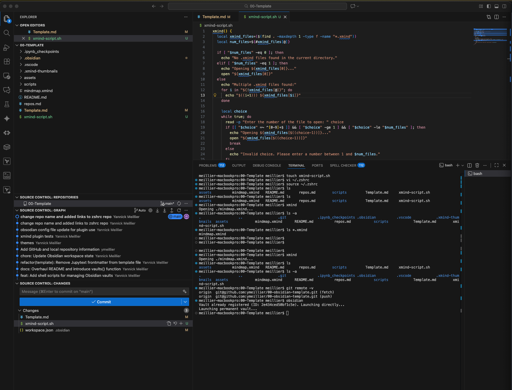

This repository contains the .obsidian config directory used as our reference obsidian configurations when creating a new permanent or temporary vault with the `obsidian` or `obsidian_tmp` commands.

Repo: [https://github.com/ymeillier/00-obsidian-template](https://github.com/ymeillier/00-obsidian-template)

[Template.md](./Template.md) covers configurations, plugins, and customization configured on our template vault. 

See:

# Markdown Syntax Refreshers

## xmind via Xmind Linker

To show the view of a mindmap created with xmind in our markdown note.

With an Xmind mindmap `mindmap.xmind`:
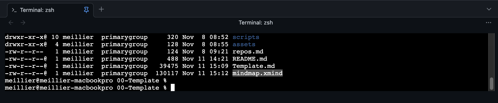

and in the xmind application:
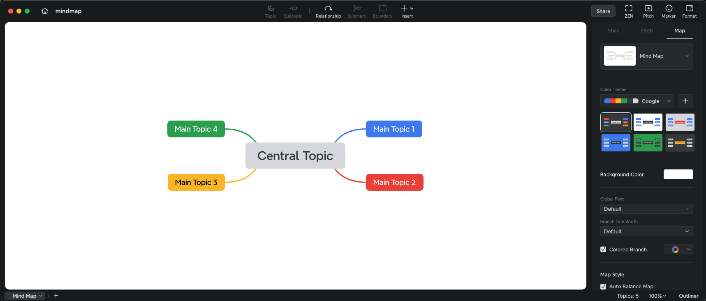

in the note use the standard embedding syntax:

![[mindmap.xmind]]

## Copy entire pages content: cdn url to file
When copy paste the content of a qwiklab for example, it will paste fine into a markdown note however the images will point to the url of the cdn image....
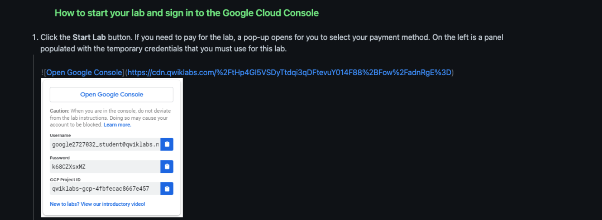
we want to download the images to our local vault tho and for that we just have to use the built-in function `Download attachments for current file`

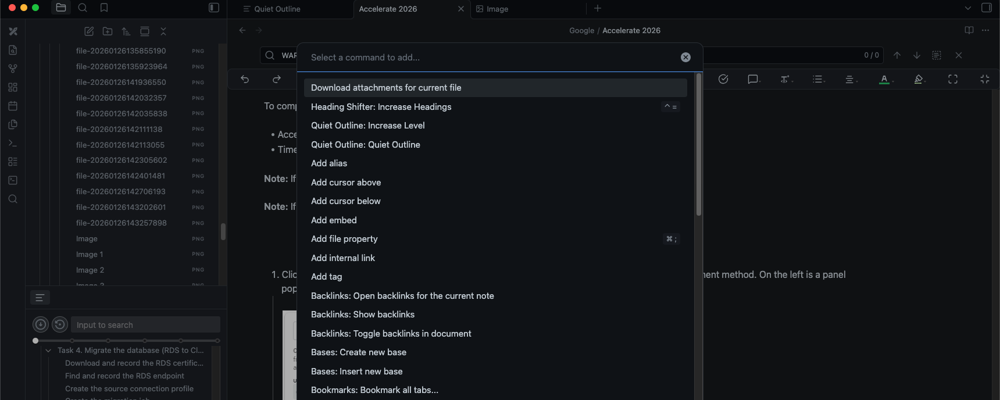

 

IT will find the file to be downloaded
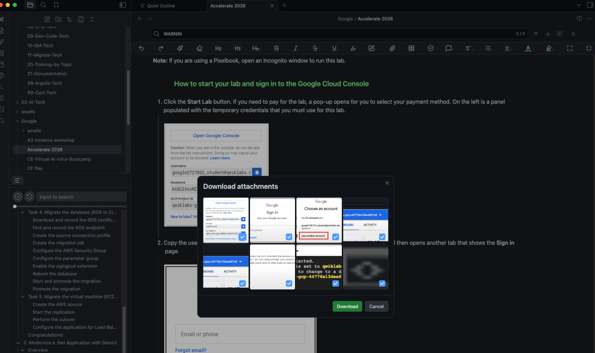

and once done, the markdown is updated to pointing to those local files:
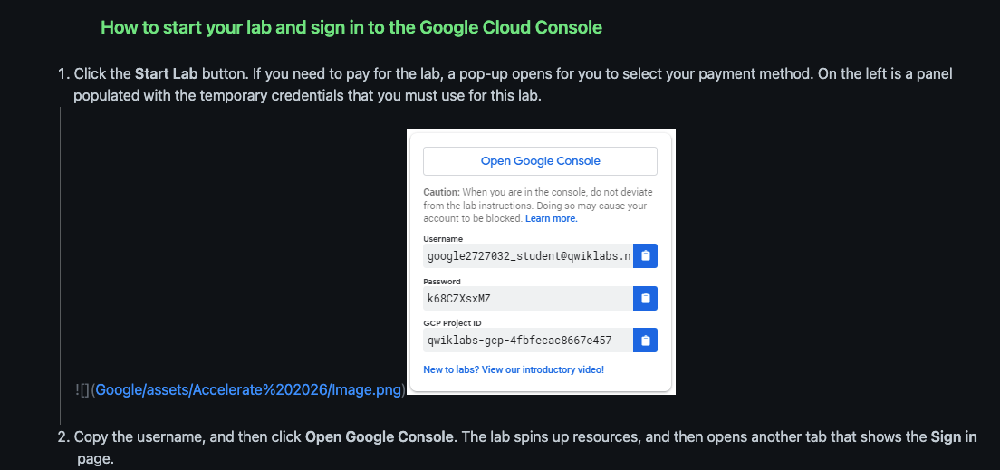

## Flavored markdown

https://help.obsidian.md/obsidian-flavored-markdown
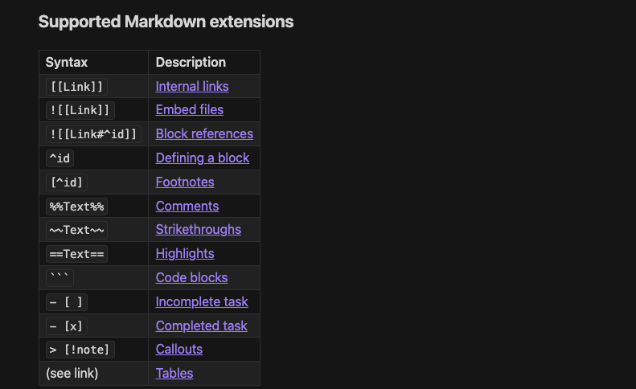

## callouts

https://help.obsidian.md/callouts#Supported+types

### Note

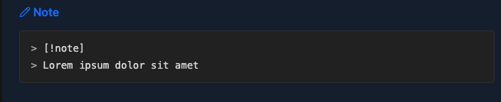

### Abstract
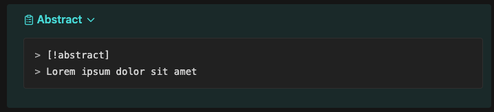

### info
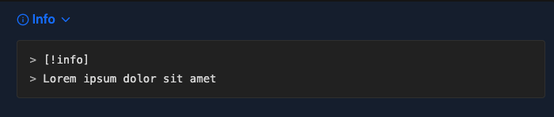
### Todo

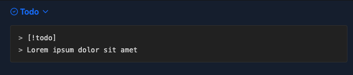

### tip|hint|important
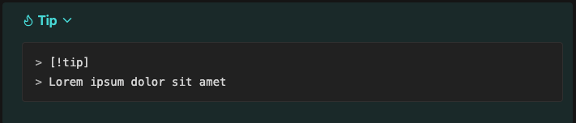
### Success | check | done
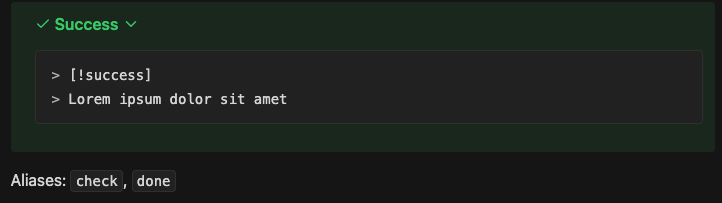

### Question | help | faq

### Warning | caution | attention
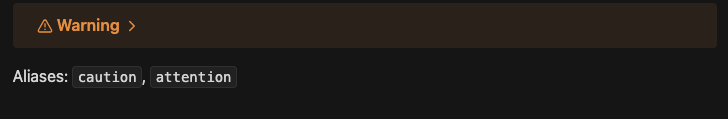

### Failure | fail | missing
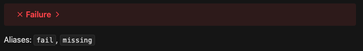

### danger | error
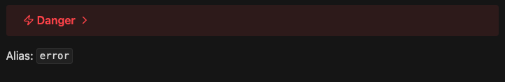
### Bug 

### Example

### Quote
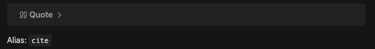
