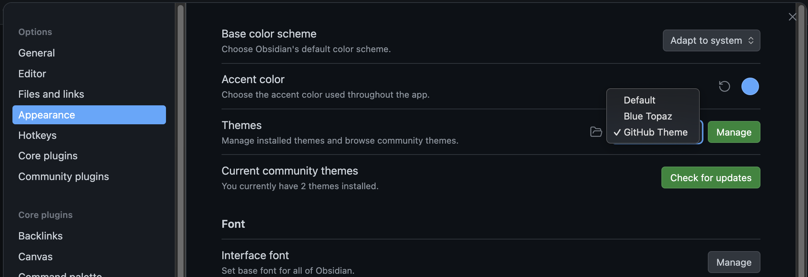

This repository contains the .obsidian config directory that is used a our reference obsidian configurations and plugins when creating a new vault with the `obsidian` or `obsidian_tmp` commands.
See [https://github.com/ymeillier/043-obsidian-setup/blob/main/README.md](https://github.com/ymeillier/043-obsidian-setup/blob/main/README.md) for our Obsidian workflow.


Template.md explains configurations and plugins configured on our template vault. 

# Themes




# Scripts

I personally needed to use Obsidian to open md files without necessarily creating a new Vault every time.

For example if I was to clone the kubernetes-the-hard-way repo, from 
```
https://github.com/kelseyhightower/kubernetes-the-hard-way
```


and would like to review the md files at hte root and within the docs/ folder, 


we would need to open that folder as a vault:

However, this is just one repo and example. When doing so every time we need to open an md file, we will end up with lots of vaults. 


I also  do have a number of Vaults for various projects but want to limit the number of "permanent" vaults managed by Obsidian.  

My first objectives was to create tools to manage temporary vaults.

WE have a number of scripts that start with "`obsidian`"

we have a function in ~/.zshrc to allow tab autocompletion

```bash
# Custom completion function for 'obsidian' scripts
_obsidian_funcs()
{
    local cur="${COMP_WORDS[COMP_CWORD]}"
    # Find all functions starting with 'obsidian' and filter results
    COMPREPLY=( $(compgen -A function "obsidian" | grep "^${cur}") )
}
# Register the custom function to be used when the user types 'obsidian'
complete -F _obsidian_funcs obsidian
```

Now TAB TAB after obsidian will show our available functions:

```bash
# Custom completion function for 'obsidian' scripts
_obsidian_funcs()
{
    local cur="${COMP_WORDS[COMP_CWORD]}"
    # Find all functions starting with 'obsidian' and filter results
    COMPREPLY=( $(compgen -A function "obsidian" | grep "^${cur}") )
}
# Register the custom function to be used when the user types 'obsidian'
# -o nospace often helps with display clarity for custom completions.
complete -F _obsidian_funcs -o nospace obsidian
```

## obsidian_vaults()

use: "`obsidian_vaults`"
or
"`obsidian_vaults -s`" for a sorted output:

"`obsidian_vaults`"

"`obsidian_vaults -s`"


Existing Vaults are listed in the left pane of the Vault switcher: 

or also from the vault switcher within an already opened Obsidian Vault window:


When vaults are created, Obsidian will assign a unique ID to the Vault and keep track of the existing Vault in its obsidian.json file in 
```
~/Library/Application Support/obsidian/obsidian.json
```


We created a first bash function to list the vaults from the CLI (vaults.sh in repo):

```bash
function vaults() {
    local config_file="$HOME/Library/Application Support/obsidian/obsidian.json"
    
    # Check if the config file exists
    if [ ! -f "$config_file" ]; then
        echo "Error: Obsidian configuration file not found at $config_file"
        return 1
    fi

    # Check if jq is available
    if ! command -v jq &> /dev/null; then
        echo "Error: 'jq' command not found. Please ensure it is installed."
        return 1
    fi

    echo "--- Obsidian Vaults ---"
    
    # The existing jq logic is wrapped in the function
    cat "$config_file" | jq -r '.vaults | to_entries[] | 
      .value.ts = (.value.ts / 1000 | todate) |
      "ID: \(.key) | Path: \(.value.path) | Last Opened: \(.value.ts) | Open: \(.value.open // false)"' |
      column -t -s '|'
}
```

The vaults() function is placed in our ~/.zshrc file so that it can be executed invoking the ```vaults``` command.


## obsidian_tmp()

The next function allows creating a vault from any folder but a vault that will be using a vault ID starting with 14 '9s' so that they can easily be identified as a temporary Vault. 

There is an associated md_cleanup() function used to delete that vault when editing is complete so that we don't keep creating new vaults for each new file we open in Obsidian. 

For example, using the example of cloning another repo which contains a markdown file i'd like to open in obsidian. Or say i have a new md file that craeted in a tmp folder that i would like to edit with obsidian, but not keep as a vault. 


we use the open_md() function to open that directory as vault:


this will open Obsidian:

we edit hte file in obsidian

close the window manually, and validate the md file changes were saved:


if run md_open() again, we are back to being able to edit the file via Obsidian.

The Vault is available in the Vault switcher:


Now if we run vaults(), we see our new vault with its Vault ID starting with 14 9s:

## obsidian_cleanup_pwd()
This function can be run from a directory that has a .obsidian file to clean up the directory as well as the vault ID from the obsidian.json file.

We now run the md_cleanup() function to cleanup the registration of the folder as a Vault in Obsidian and can validate with the vaults() function that our vault no longer exist. 


Only the OBsidian vault was deleted, the files are intact:


## obsidian_cleanup_alltmp()

To clean up all temporary vaults (registration and .obsidian files in directory). Without affecting content.


Sometimes you might forget running the cleanup function and over time you might have a number of vaults that were meant to be temporary. 
We had those being created with the same identifier starting with 14 9s and the md_cleanup_all() function will clean any vault starting with that ID prefix

For example We are actually currently editing this exact md file that you are reading in Obsidian using such a temporary Vault. 


When we run the md_cleanup_all() function, our obsidian window will close and its vault will be deleted:


however we can open our folder as a vault again and resume editing:


## obsidian_cleanup_id()

Used to cleanup a specific Vault (vault registration in obsidian.json as well as .obsidian file)

```bash

function obsidian_cleanup_id() {
    # 1. Input Validation
    if [ -z "$1" ]; then
        echo "Error: Vault ID is required as the first argument."
        echo "Usage: md_cleanup_specific <Vault_ID>"
        return 1
    fi

    local vault_id_to_remove="$1"
    local config_file="$HOME/Library/Application Support/obsidian/obsidian.json"

    if ! command -v jq &> /dev/null; then
        echo "Error: 'jq' is required for JSON manipulation. Aborting."
        return 1
    fi

    echo "--- Initiating Cleanup for Specific Vault ID: $vault_id_to_remove ---"
    
    # 2. Extract Vault Path from JSON
    # Use jq to get the path of the specific vault ID
    local vault_dir=$(jq -r --arg id "$vault_id_to_remove" \
        '.vaults[$id].path' \
        "$config_file" 2>/dev/null)

    # Check if the vault ID exists in the configuration
    if [ -z "$vault_dir" ] || [ "$vault_dir" = "null" ]; then
        echo "❌ Vault ID '$vault_id_to_remove' not found in $config_file."
        return 2
    fi
    
    # 3. Perform Cleanup Actions
    echo "Processing Vault Path: $vault_dir"
    
    # 3a. File System Cleanup (Removes the .obsidian folder)
    if [ -d "$vault_dir/.obsidian" ]; then
        read -r -p "⚠️ Confirm removal of the **.obsidian folder** at '$vault_dir/.obsidian' (y/N)? " confirmation
        if [[ "$confirmation" =~ ^[Yy]$ ]]; then
            rm -rf "$vault_dir/.obsidian"
            echo " - ✅ Removed .obsidian folder."
        else
            echo " - ⏭️ Skipped removal of .obsidian folder."
        fi
    else
        echo " - ℹ️ .obsidian folder not found at path (already cleaned or never existed)."
    fi
    
    # 3b. JSON Configuration Cleanup (Deletes the entry by ID)
    read -r -p "⚠️ Confirm removal of Vault ID **'$vault_id_to_remove'** from $config_file (y/N)? " confirmation_json
    if [[ "$confirmation_json" =~ ^[Yy]$ ]]; then
        jq "del(.vaults[\"$vault_id_to_remove\"])" \
            "$config_file" > "$config_file.tmp" && mv "$config_file.tmp" "$config_file"
        echo " - ✅ Removed ID from obsidian.json."
    else
        echo " - ⏭️ Skipped removal of Vault ID from obsidian.json."
    fi

    # 4. Quit Obsidian (To force immediate config reload)
    osascript -e 'quit app "Obsidian"' 2>/dev/null
    echo ""
    echo "✨ Complete. Cleanup for Vault ID '$vault_id_to_remove' finished and Obsidian closed."
}
```


## obsidian()

Used to open an existing Vault but via the cli instead of doing so from the Vault switcher/GUI. 

Note that if the vault was created  via the GIU with specific plugins and configurations (.obsidian), nothing will be changed b invoking this function. We are just opening the vault . The settings of the template are only used when creating new Vaults. 
If you wanted an existing Vault to use the settings of the template, use the md_cleanup_id() function to cleanup and obsidian . to create the new permanent vault. 

This one is used when wanting to either:
1 - create a new Vault for a folder
2 - Open an existing vault from the cli.

For example, if we navigate to "/Users/meillier/Documents/Obsidian/Google-v2/Google-v2", this is a Vault, we know that because it has the .obsidian directory:


if we just type "obsidian", it will open the vault in another Obsidian window.

We could also create a new Permanent Vault using this same function. The Vault ID will not use the 999x prefix.


## misc: open error

If you run into this error:


it could be that you removed the vault from the list via the GUI which does not delete the .obsidian folder but cleansup the vault ID from the obsidian.json file queries with vaults()


## misc: .zshrc and .bash_profile

make sure .zshrc is sourced by your bash profile:

```
# Execute the main configuration file for interactive shells
source ~/.zshrc

# If the shell is interactive, run the zshrc file
[[ -r ~/.zshrc ]] && source ~/.zshrc
```


# Plugins

I keep my template Obsidian vault at 
```
/Users/meillier/Documents/Obsidian/00-Template
```


One great benefits of Obsidian is its rich ecosystem of community plugins that extend its functionality.

I have a couple favorites that I always want loaded with my Obsidian Vault: Colored Text, Image Toolkit to zoom on screenshots, Quiet Outline ...


Plugin configurations for a Vault are managed via json files in the .obsidian file:


Each plugin code and optionally configurations are saved as json files within each plugin folder:


Each new Vault created will however come up without these plugins since Obsidian leaves it to the user to have its different Vaults configured differently if needed.

We needed a way to ensure that each new Vault created via the utilities we created would also copy the configs of our reference/template Vault.

When creating new vaults, our scripts thus copy those configs.


For example we create a new directory and md file:

and md_open(). It will ask if we trust the author of the vault:


and then we can validate that this new vault comes configured with our plugins:

Note: Plugins are accesses via the settings icon in the bottom left:

One of hte most important configuration of our Template Vault is how screenshots are saved in our Vault.
They should be saved in a subfolder under assets/ named after our .md:

This is set by the Files and Links config:


added to a subdirectory of the folder because it was not configured properly:

This is what the customer attachment location plugin is for using these configurations for making sure the screenshots are saved an assets folder 


# Translucion: Aggregating Notes/.md

---

## 🔗 Using Transclusion (Embedding)

Transclusion is the most direct and dynamic way to achieve this. It pulls the content of one note (or a section of a note) and displays it directly inside another note.

### **How to Embed a Full Note**

1. Create a **new markdown file** (e.g., `Aggregate View.md`). This will be your master file.
    
2. In this new file, use the following syntax for each note you want to include:
    
    Markdown
    
    ```
    ![[Name of the other note]]
    ```
    
    - The `!` at the beginning is what turns a regular link (`[[Note Name]]`) into an **embed**.
        
    - **Obsidian will automatically show you suggestions** as you type the file name.
        
3. When you switch your `Aggregate View.md` note to **Reading View**, the content of the linked notes will be displayed inline. If you edit the original source note, the content in the `Aggregate View` updates automatically.
    

**Example:**

If you have notes named `Chapter 1.md`, `Chapter 2.md`, and `Chapter 3.md`, your `Aggregate View.md` would look like this in **Editing View**:

Markdown

```
# My Complete Document

![[Chapter 1]]

---

## Part II

![[Chapter 2]]

![[Chapter 3]]
```

When you view this in **Reading View**, you will see the actual content of all three files, appearing as one continuous document.

---

### **Embedding Specific Sections (Headings or Blocks)**

You can also embed only a specific part of a note, which is great for combining relevant pieces without pulling in the entire source file.

|**Target**|**Syntax**|
|---|---|
|**Specific Heading**|`![[Note Name#Heading Name]]`|
|**Specific Block**|`![[Note Name#^block-id]]`|

- To embed a heading, type the note name, then a hash sign (`#`), and then the heading name (Obsidian will suggest them).
    
- To embed a **block** (like a paragraph, list, or code block), you need to give the block a unique identifier by typing `^block-id` at the end of the paragraph/list item in the source note. Then, use the syntax `![[Note Name#^block-id]]` in your aggregate note.
    

---

## 🛠️ Using Community Plugins

While transclusion is the standard way, community plugins offer more advanced ways to aggregate content, especially if you need to dynamically search and collect content based on criteria (like tags or folders).

### **The Dataview Plugin**

The **Dataview** community plugin is extremely popular for creating dynamic content lists and aggregation.

It allows you to use queries to search your vault and display data—or even the _text_—from matching notes.

**Example: Displaying content from all files in a folder**

You can use DataviewJS to query and embed content from all notes in a specific folder.

Code snippet

```
let pages = dv.pages('"Your Folder Name"')
for (let p of pages) {
    dv.header(2, p.file.name)
    dv.paragraph(p.file.outlinks.filter(l => l.path.includes("important topic")).text) // This is a simplified example
    dv.el("br", "")
}
```

- **Note:** The Dataview approach typically requires some basic coding/query language, and the complexity depends on _what_ content you want to aggregate and how you want to display it.
    

### **Notes Merger Plugin (for Static Aggregation)**

A plugin like **Notes Merger** is designed to take multiple notes and physically **merge** them into a single, permanent markdown file. This is useful if you want a static, non-updating copy of the combined content, but it's less common than dynamic transclusion.

- This creates a new, independent file; changes to the source notes **will not** update the merged note.
    

The built-in **Transclusion** feature is likely the best solution for the "one view" requirement, as it's dynamic and requires no extra plugins.
## Glow

Glow is a clin based markdown reader that can be used as an alternative to Obsidian when you need simpler and quicker tools for reviewing and potentially editing the markdown.


[https://github.com/charmbracelet/glow](https://github.com/charmbracelet/glow)


# Plugins List
## Colored Text
Allows you to change the color of text within your notes, which is useful for highlighting and organizing information visually.

## Custom Attachment Location
Gives you control over where new attachments (like images) are saved, using rules to automatically place them in specific folders.

## Excalidraw
Integrates the Excalidraw whiteboarding tool, allowing you to create and embed editable sketches, diagrams, and handwritten notes.

## Dataview
A powerful tool that lets you query, list, and table data from your notes based on metadata like tags and frontmatter fields.

## Editing toolbar
Adds a customizable toolbar to the editor with buttons for common formatting actions like bold, italics, lists, and headings.

## Image Toolkit
Improves the handling of images by adding features like a full-screen viewer, zoom, rotation, and easy copying.

## JupyMD
Enables you to run Jupyter Notebook code blocks (primarily Python) directly within your notes and see the rendered output.

## Omnisearch
A powerful search tool that provides more advanced search capabilities, including fuzzy matching and searching inside attachments like PDFs.

## Quiet Outline 
Offers a cleaner, more customizable outline view of your document's headings.

## Terminal
Embeds a command-line terminal directly into Obsidian, allowing you to run shell commands without leaving the application.

## Code emitter
# Custom Attachment Location
Its configurations are set as such to match my intended behavior of storing files in a specific asset folder and subfolder named after the md file


# Code Emitter

```Python
!gcloud auth list
```


# Jupyter/Colab from Obsidian
There is a popular **Obsidian community plugin** called **JupyMD** that allows you to create, run, and sync **Jupyter Notebook** functionality within your Obsidian notes.

There is currently **no community plugin** that allows directly creating and running a **Colab notebook** from within Obsidian, as this would require a specific integration with the Google Colaboratory service.

---

## 💻 JupyMD Plugin

The **JupyMD** plugin bridges the gap between your Markdown notes and Jupyter Notebooks using a tool called **Jupytext**.

### Key Functionality

- **Live Code Execution:** It enables you to run code blocks (currently limited primarily to **Python**) directly within your Obsidian note, making the Markdown file behave like an interactive Jupyter Notebook.
    
- **Rich Output Rendering:** You can see the outputs, including **plots (Matplotlib)** and **Pandas DataFrames**, rendered below the code block in Obsidian.
    
- **Bidirectional Sync:** The plugin uses <font color="#2DC26B">Jupytext</font> to automatically create and synchronize a linked **<font color="#2DC26B">`.ipynb`</font>** file (the actual Jupyter Notebook file format) with your Obsidian Markdown note (**`.md`**). **<font color="#2DC26B">Changes made in either the Markdown file or the Jupyter Notebook are mirrored in the other</font>**.
    
- **Persistent Environment:** Variables and imports defined in one code block are maintained and available to subsequent code blocks within the same note, just like in a standard Jupyter session.


### Prerequisites

To use JupyMD, you must have the following installed on your system outside of Obsidian:
1. **Python**
2. **Jupyter Notebook**
3. **Jupytext**

Out of the box JupyMD is set to use the python interpreter.  The code blocks of the jupyter notebook will call for hte execution of jupyter and we cannot change that to jupyer3.
If we create a virtual environment anyway, which is a best practice, it will have the python interpreter


**Best Practice: Use a Virtual Environment**


It's highly recommended to use a virtual environment to manage dependencies for different projects, keeping them isolated from your system Python installation. However this will require adjusting the path to the python interpreter in tehe jupyMD settings.

Here's how you can do it:

1. **Create a virtual environment:** Open your terminal and navigate to your project directory, then run:
        `python3 -m venv {{basename}}  # Replace 'myenv' with your preferred environment name`
    
2. **Activate the virtual environment:**
        `source myenv/bin/activate`
    
    Your shell prompt will usually change to indicate the active environment (e.g., `(myenv) meillier@meillier-macbookpro ... %`).
    
3. **Install packages within the environment:** Now, any packages you install will be local to this environment.
        `python3 -m pip install jupyterlab`
        `python3 -m pip install notebook`
        ``python3 -m pip install jupytext``
    
4. **Deactivate the environment:** When you're done working, you can deactivate the environment:
        `deactivate`


This approach prevents conflicts between project dependencies and keeps your global Python installation clean.

### 🛠️ The Fix: JupyMD Settings

You need to tell the JupyMD plugin, or its underlying engine, to use the correct executable path: **`/usr/local/bin/python3`**.

Since JupyMD relies on your local Jupyter setup, the fix typically involves configuring the correct **Jupyter Kernel** for the plugin to use, or, more simply, telling JupyMD where to find your Python executable.


The easiest fix is often directly in the Obsidian settings for JupyMD:

1. Go to **Settings** (Gear icon) in Obsidian.
2. Go to **Community plugins** and find **JupyMD**.
3. Look for a setting that specifies the **Python executable path** or the **Jupyter command**.
4. If a field exists, change the default value (`python` or similar) to the full path of your working executable:
    
    ```
    /usr/local/bin/python3
    ```


where the path is  `/Users/meillier/Documents/Obsidian/00-Template/template/bin/python` and was obtained from activating the venv and runnin which python.


## Detailed Steps


### 1. Create your python virtual environment:

```bash
python3 -m venv template
source template/bin/activate

# packages needed for the jupyer obsidian integration
pip install jupyterlab notebook jupytext

# packages used by our code notebook example blocks:
pip install pandas numpy
pip install pandas numpy
```

### Register the Environment as a Jupyter Kernel (Crucial Step)
```bash
pip install ipykernel
python3 -m ipykernel install --user --name=template_venv --display-name "Template Project VEnv"
```


### JupyMD settings


where the path is  `/Users/meillier/Documents/Obsidian/00-Template/template/bin/python` and was obtained from activating the venv and runnin which python.


### Frontmatter
you have to activate source mode to see the frontmatter yaml block:


IT needs to have the jupyterkernel settings:

```yaml
    kernelspec:
      display_name: Template Project VEnv
      name: template_venv
```


### Create notebook from md
1. Use the plugin's commands (e.g., `JupyMD: Create Jupyter notebook from note`) to activate the functionality on a specific Markdown note.

Open the Command palette with ⌘+P  and type "JupyMD..". It will display al the commands available to choose from 


### ✅ Jupyter Notebook Cells


The **JupyMD plugin** now handles the activation process internally. When you click the **Run** icon on the code block, JupyMD will:

1. Read the note's frontmatter.
2. See that it needs to use the **`template_venv`** kernel.
3. Instruct the underlying Jupyter process to start a session using the Python executable located inside your `template` venv directory.

So you do not need to do any sort of venv activations. 


```python
import pandas as pd 
import numpy as np
```

```python
# Your Python code goes here
# JupyMD will execute this block.

import pandas as pd 
import numpy as np

# Define a simple variable 
data = {"col1": [1, 2, 3], "col2": [4, 5, 6]}
df = pd.DataFrame(data)

print("Data initialized.")

```

```python
# Use the DataFrame from the previous block 
print(f"The shape of the DataFrame is: {df.shape}") 
# JupyMD will often render a DataFrame cleanly 
df
```

## Troubleshooting
Execution of code block fails


Verify virtual environment has the packages installed such as panda

```bash
source template/bin/activate

```

```bash
pip list | grep pandas
```


Verify Kernel registration


```bash
jupyter kernelspec list
```


To exit:
```bash
deactivate
```


Steps taken resolve execution issues
Here is the summarized, chronological sequence of steps we took to establish a stable, virtual-environment-backed JupyMD setup:

---

### 🛠️ JupyMD Troubleshooting & Setup Guide

This guide assumes your project files are in a folder named `00-Template` and your virtual environment is named `template`.

### Phase 1: Establish & Configure the Python Virtual Environment

This phase isolates your project dependencies and ensures the required tools are installed.

1. **Create and Activate the Virtual Environment (Venv):**
    
    - Navigate to your project directory (`00-Template`).
        
    - Create the environment: `python3 -m venv template`
        
    - **Fix Permissions (Crucial):** If activation fails with "permission denied," grant execute permission: `chmod +x template/bin/activate`
        
    - Activate the environment: `source template/bin/activate`
        
2. **Install Required Packages:**
    
    - While the venv is **active**, install the core tools and data science libraries. The final fix involved a clean reinstall:
        
        Bash
        
        ```
        pip uninstall -y jupytext ipykernel notebook jupyterlab
        pip install jupytext ipykernel notebook jupyterlab pandas numpy
        ```
        
3. **Register the Venv as a Jupyter Kernel:**
    
    - Still with the venv **active**, register a stable kernel name. This is what JupyMD will look for:
        
        Bash
        
        ```
        python3 -m ipykernel install --user --name=**template_venv** --display-name "Template Project VEnv"
        ```
        
4. **Get the Absolute Path:**
    
    - Get the full path to the Python executable inside your venv (used in JupyMD settings):
        
        Bash
        
        ```
        which python
        ```
        
        _Example:_ `/Users/meillier/Documents/Obsidian/00-Template/template/bin/python`
        

---

### Phase 2: Configure the Obsidian Plugin & Note

This phase links the environment and sets up the correct sync protocol.

1. **Configure JupyMD Plugin Settings (Critical Step):**
    
    - Go to **Settings** -> **Community plugins** -> **JupyMD**.
        
    - Set the **Python interpreter** field to the **absolute path** found in Step 4 of Phase 1. (e.g., `/Users/meillier/.../template/bin/python`)
        
    - Set **Bidirectional sync** to **OFF** to prevent the `.ipynb` file from overwriting the Markdown code blocks.
        
2. **Configure Note Frontmatter:**
    
    - Open your Markdown note (`Template.md`) and switch to **Source Mode**.
        
    - Add the following YAML block at the absolute top of the file, ensuring the `name` exactly matches the kernel registered in Step 3 of Phase 1:
        
        YAML
        
        ```
        ---
        jupyter:
          jupytext:
            formats: ipynb,md
            kernelspec:
              name: **template_venv**
              display_name: Template Project VEnv
        ---
        ```
        

---

### Phase 3: Final Execution and Verification

1. **Restart Obsidian:** Fully close and reopen Obsidian for the plugin settings to take effect.
    
2. **Delete the old `.ipynb` file** (if it exists).
    
3. **Create the new linked notebook:** Open the Command Palette (`Ctrl+P`) and run the command **`JupyMD: Create Jupyter notebook from note`**.
    
4. **Test:** Execute a code block using the `python` language tag. It should now successfully run and find your installed libraries like `pandas`.
5. 
---

## gcloud in Jupyter notebook Cells

In a Jupyter Notebook cell running a Python kernel, prefixing any command with an exclamation mark (`!`) tells the interpreter to run that command in the **underlying operating system shell** (Bash, Zsh, etc.) instead of as Python code.


```python
!gcloud auth list
```


```python
import subprocess

# This command will use the system shell to execute the string
# Note: shell=True should be used cautiously
subprocess.run("gcloud auth list", shell=True)
```

Open ipynb in Jupyter

```bash
source template/bin/activate
jupyter notebook
```

```python
!gcloud auth list
```

A browser window/tab opens with jupyter:


open teh ipynb notebook:


Create a new cell and run:


but in obsidian via JupyMD:
```python
!glcoud auth list
```


one has to use subprocess:

```python
import subprocess
import shlex

# Define the command string
command_str = "gcloud auth list"

# Split the command string into a list of arguments
command_list = shlex.split(command_str)

# Execute the command and capture output
try:
    result = subprocess.run(
        command_list,
        capture_output=True,
        text=True,
        check=True
    )
    # Print the gcloud output
    print("--- Gcloud Output ---")
    print(result.stdout)

except subprocess.CalledProcessError as e:
    print(f"Error running gcloud command: {e}")
    # Print the error output
    print(e.stderr)
```

which when executed returns:

#### gcloud wrapper function:

```python
import subprocess
import shlex

def g(command_str, silent_error=False):
    """
    A simple wrapper function to execute gcloud or any shell command
    from a Jupyter-like environment (like JupyMD).

    This function automatically splits the command string and uses 
    Python's subprocess module for robust execution and output capture.

    Args:
        command_str (str): The full command string to execute (e.g., "gcloud auth list").
        silent_error (bool): If True, suppresses error traceback/output and only prints 
                             the standard error message. Useful for commands that might fail 
                             but shouldn't stop the notebook.

    Returns:
        str: The standard output (stdout) of the command, or None if the command fails.
    """
    # 1. Split the command string safely into a list of arguments
    # This handles spaces within quotes correctly.
    try:
        command_list = shlex.split(command_str)
    except Exception as e:
        print(f"Error splitting command: {e}")
        return None

    # 2. Execute the command
    try:
        result = subprocess.run(
            command_list,
            capture_output=True,
            text=True,
            check=True  # Raises CalledProcessError for non-zero exit codes
        )
        
        # 3. Print the output and return it
        print(result.stdout.strip())
        #return result.stdout.strip()

    except subprocess.CalledProcessError as e:
        error_output = e.stderr.strip()
        
        if not silent_error:
            print(f"--- GCLOUD COMMAND FAILED ---")
            print(f"Command: {command_str}")
            print(f"Return Code: {e.returncode}")
            print(f"Error: {error_output}")
        else:
            print(f"Error (Return Code {e.returncode}): {error_output}")
            
        return None
    
    except FileNotFoundError:
        print("ERROR: The 'gcloud' executable was not found. Ensure gcloud CLI is installed and in your system PATH.")
        return None
```

```python
g("gcloud auth list")
```

this will allow running the gcloud command:

### g() and get()


execute_gcloud()

```python
import subprocess
import shlex

def _execute_gcloud(command_str, silent_error=False):
    """
    INTERNAL CORE FUNCTION: Executes the shell command using subprocess.
    This function is ALWAYS silent regarding stdout, only returning the result.
    """
    try:
        command_list = shlex.split(command_str)
    except Exception:
        print(f"Error splitting command: {command_str}")
        return None, None # Returns (output, error)

    try:
        result = subprocess.run(
            command_list,
            capture_output=True,
            text=True,
            check=True
        )
        
        # Returns the output string and None for error
        return result.stdout.strip(), None

    except subprocess.CalledProcessError as e:
        # Returns None for output and the error string
        error_output = e.stderr.strip()
        
        if not silent_error:
            print(f"--- GCLOUD COMMAND FAILED (Return Code {e.returncode}) ---")
            print(f"Command: {command_str}")
            print(f"Error Output: {error_output}")
        return None, error_output # Return None for stdout
    
    except FileNotFoundError:
        print("ERROR: The 'gcloud' executable was not found. Ensure gcloud CLI is installed.")
        return None, "gcloud executable not found"

```

g()

```python
def g(command_str, silent_error=False):
    """
    g() - SIMPLE EXECUTION (Prints Output)
    Runs a gcloud command and prints the output once. Does NOT return a capturable value.
    """
    # Calls the executor and asks for the output (return_output=True is unnecessary now)
    output, error = _execute_gcloud(command_str, silent_error=silent_error)
    
    if output is not None:
        print(output)
        
    # Always returns None to suppress the notebook's automatic output display
    return None 
```

get()

```python
def get(command_str, silent_error=False):
    """
    get() - ASSIGNMENT (Silent Capture)
    Runs a gcloud command and returns the output string for assignment. Prints nothing on success.
    """
    # Calls the executor
    output, error = _execute_gcloud(command_str, silent_error=silent_error)
    
    # Returns the clean output string if successful, otherwise None
    return output

```


in bash would do:
```bash
REGION_NAME=$(gcloud config get-value compute/region)
```

with our function:


```python
g("gcloud config get-value compute/region")
```

```python
region_name = get("gcloud config get-value compute/region")
print(region_name)
```


when executed it gives us the expected behavior of command output (`print(output)`) vs value extraction (`return(output)`):


## ☁️ Colab Integration (Workaround)

Since there's no direct Colab plugin, the common workaround for linking to Google Colaboratory notebooks is to **link out** from your Obsidian note:

- **Markdown Link:** You can simply create a Markdown link in your note to the Colab notebook's URL: `[My Project Colab Notebook](https://colab.research.google.com/drive/...)`
    
- **iFrame (Limited):** Some users have explored using an `<iframe>` in Obsidian to embed a preview of a public notebook (often via services like Binder or simply the Colab share link). However, this method is usually limited to **viewing** and does **not** allow for running or editing the code interactively within Obsidian.

#
# Custom CSS Configurations

## 🛠️ Resize Edit Area with Window Size

This method doesn't require a new community plugin and will make the editable text area width responsive to the size of its containing pane, or the entire window if the pane is maximized. 

### 1. Create the CSS Snippet File

1. Navigate to your Obsidian vault's settings: **Settings** (Gear icon) → **Appearance**.
    
2. Scroll down to the **CSS Snippets** section and click the folder icon to open the snippets folder.
    
3. In that folder (e.g., `.obsidian/snippets/`), create a new file and name it something like `auto-resize-editor.css`.
    
4. Paste the following code into the file and save it:


CSS

```
/*
  This snippet overrides the default fixed 'readable line length' 
  width (usually 700px or similar) and makes it a percentage 
  of the available space.
*/

body {
  /* This is the global variable for the note content width */
  --file-line-width: 95%; /* Use 95% or 100% for full width */
}

/* Ensure the editor and preview respect the new width */
.markdown-source-view.is-readable-line-width .CodeMirror,
.markdown-preview-view.is-readable-line-width .markdown-preview-sizer {
  max-width: var(--file-line-width) !important;
  width: var(--file-line-width) !important;
}

/* Optional: Center the text when using less than 100% */
.markdown-source-view.is-readable-line-length,
.markdown-preview-view.is-readable-line-length {
  margin: 0 auto;
}
```

### 2. Activate the Snippet

1. Go back to **Obsidian Settings** → **Appearance**.
    
2. In the **CSS Snippets** section, click the **Refresh** button next to the folder icon.
    
3. Your new snippet (`auto-resize-editor`) should appear in the list.
    
4. **Toggle the switch to ON** to activate the snippet.


### 3. Ensure "Readable Line Length" is ON

For this CSS to correctly override the line length, the built-in Obsidian setting **must be enabled**:

1. Go to **Obsidian Settings** → **Editor**.
    
2. Ensure that the setting **Readable line length** is **Toggled ON**.


With this CSS snippet, the width of your editing area will now automatically adjust as you resize the Obsidian window or the note pane, based on the percentage you set (e.g., `95%`).
