---
jupyter:
  jupytext:
    cell_metadata_filter: -all
    formats: ipynb,md
    kernelspec:
      display_name: Template Project VEnv
      name: template_venv
    text_representation:
      extension: .md
      format_name: markdown
      format_version: '1.3'
      jupytext_version: 1.18.1
  kernelspec:
    display_name: Python 3 (ipykernel)
    language: python
    name: python3
---


# Plugins List

## 
# Jupyter/Colab from Obsidian
There is a popular **Obsidian community plugin** called **JupyMD** that allows you to create, run, and sync **Jupyter Notebook** functionality within your Obsidian notes.

There is currently **no community plugin** that allows directly creating and running a **Colab notebook** from within Obsidian, as this would require a specific integration with the Google Colaboratory service.

---

## 💻 JupyMD Plugin

The **JupyMD** plugin bridges the gap between your Markdown notes and Jupyter Notebooks using a tool called **Jupytext**.

### Key Functionality

- **Live Code Execution:** It enables you to run code blocks (currently limited primarily to **Python**) directly within your Obsidian note, making the Markdown file behave like an interactive Jupyter Notebook.
    
- **Rich Output Rendering:** You can see the outputs, including **plots (Matplotlib)** and **Pandas DataFrames**, rendered below the code block in Obsidian.
    
- **Bidirectional Sync:** The plugin uses <font color="#2DC26B">Jupytext</font> to automatically create and synchronize a linked **<font color="#2DC26B">`.ipynb`</font>** file (the actual Jupyter Notebook file format) with your Obsidian Markdown note (**`.md`**). **<font color="#2DC26B">Changes made in either the Markdown file or the Jupyter Notebook are mirrored in the other</font>**.
    
- **Persistent Environment:** Variables and imports defined in one code block are maintained and available to subsequent code blocks within the same note, just like in a standard Jupyter session.


### Prerequisites

To use JupyMD, you must have the following installed on your system outside of Obsidian:
1. **Python**
2. **Jupyter Notebook**
3. **Jupytext**

Out of the box JupyMD is set to use the python interpreter.  The code blocks of the jupyter notebook will call for hte execution of jupyter and we cannot change that to jupyer3.
If we create a virtual environment anyway, which is a best practice, it will have the python interpreter
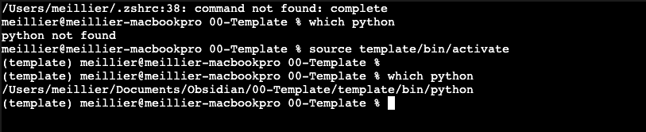


**Best Practice: Use a Virtual Environment**


It's highly recommended to use a virtual environment to manage dependencies for different projects, keeping them isolated from your system Python installation. However this will require adjusting the path to the python interpreter in tehe jupyMD settings.

Here's how you can do it:

1. **Create a virtual environment:** Open your terminal and navigate to your project directory, then run:
        `python3 -m venv {{basename}}  # Replace 'myenv' with your preferred environment name`
    
2. **Activate the virtual environment:**
        `source myenv/bin/activate`
    
    Your shell prompt will usually change to indicate the active environment (e.g., `(myenv) meillier@meillier-macbookpro ... %`).
    
3. **Install packages within the environment:** Now, any packages you install will be local to this environment.
        `python3 -m pip install jupyterlab`
        `python3 -m pip install notebook`
        ``python3 -m pip install jupytext``
    
4. **Deactivate the environment:** When you're done working, you can deactivate the environment:
        `deactivate`


This approach prevents conflicts between project dependencies and keeps your global Python installation clean.

### 🛠️ The Fix: JupyMD Settings

You need to tell the JupyMD plugin, or its underlying engine, to use the correct executable path: **`/usr/local/bin/python3`**.

Since JupyMD relies on your local Jupyter setup, the fix typically involves configuring the correct **Jupyter Kernel** for the plugin to use, or, more simply, telling JupyMD where to find your Python executable.


The easiest fix is often directly in the Obsidian settings for JupyMD:

1. Go to **Settings** (Gear icon) in Obsidian.
2. Go to **Community plugins** and find **JupyMD**.
3. Look for a setting that specifies the **Python executable path** or the **Jupyter command**.
4. If a field exists, change the default value (`python` or similar) to the full path of your working executable:
    
    ```
    /usr/local/bin/python3
    ```

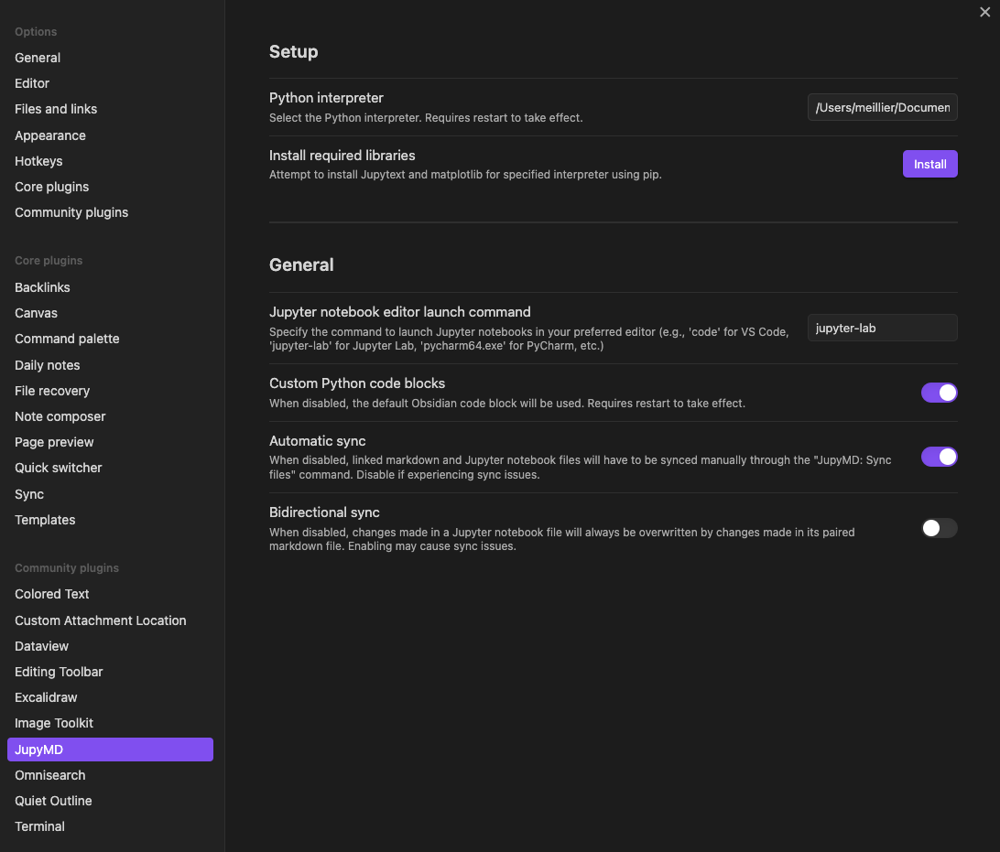
where the path is  `/Users/meillier/Documents/Obsidian/00-Template/template/bin/python` and was obtained from activating the venv and runnin which python.


## Detailed Steps


### 1. Create your python virtual environment:

```bash
python3 -m venv template
source template/bin/activate

# packages needed for the jupyer obsidian integration
pip install jupyterlab notebook jupytext

# packages used by our code notebook example blocks:
pip install pandas numpy
pip install pandas numpy
```

### Register the Environment as a Jupyter Kernel (Crucial Step)
```bash
pip install ipykernel
python3 -m ipykernel install --user --name=template_venv --display-name "Template Project VEnv"
```

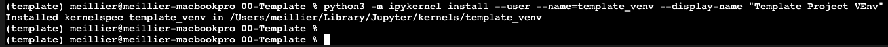


### JupyMD settings


where the path is  `/Users/meillier/Documents/Obsidian/00-Template/template/bin/python` and was obtained from activating the venv and runnin which python.


### Frontmatter
you have to activate source mode to see the frontmatter yaml block:

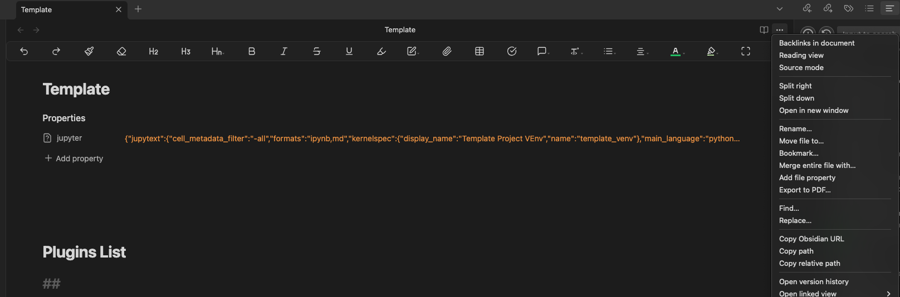
IT needs to have the jupyterkernel settings:

```yaml
    kernelspec:
      display_name: Template Project VEnv
      name: template_venv
```

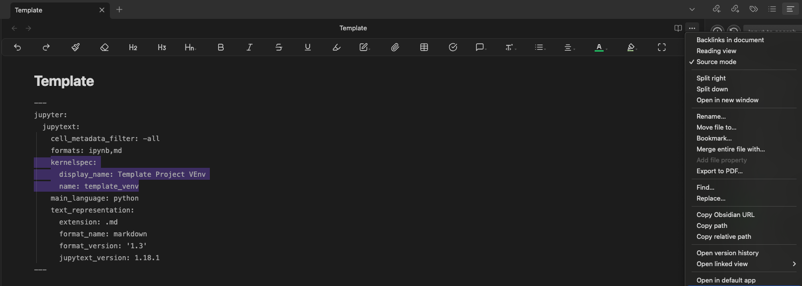

### Create notebook from md
1. Use the plugin's commands (e.g., `JupyMD: Create Jupyter notebook from note`) to activate the functionality on a specific Markdown note.

Open the Command palette with ⌘+P  and type "JupyMD..". It will display al the commands available to choose from 
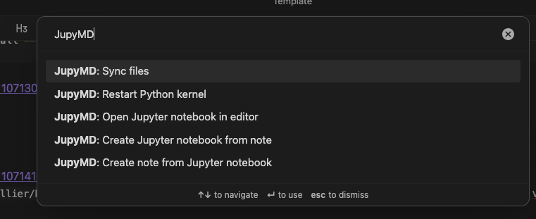


### ✅ Jupyter Notebook Cells


The **JupyMD plugin** now handles the activation process internally. When you click the **Run** icon on the code block, JupyMD will:

1. Read the note's frontmatter.
2. See that it needs to use the **`template_venv`** kernel.
3. Instruct the underlying Jupyter process to start a session using the Python executable located inside your `template` venv directory.

So you do not need to do any sort of venv activations. 


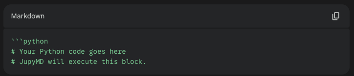

```python
import pandas as pd 
import numpy as np
```

```python
# Your Python code goes here
# JupyMD will execute this block.

import pandas as pd 
import numpy as np

# Define a simple variable 
data = {"col1": [1, 2, 3], "col2": [4, 5, 6]}
df = pd.DataFrame(data)

print("Data initialized.")

```

```python
# Use the DataFrame from the previous block 
print(f"The shape of the DataFrame is: {df.shape}") 
# JupyMD will often render a DataFrame cleanly 
df
```

## Troubleshooting
Execution of code block fails
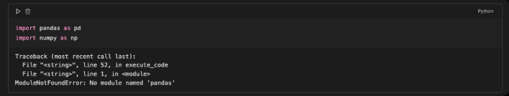

Verify virtual environment has the packages installed such as panda

```bash
source template/bin/activate

```

```bash
pip list | grep pandas
```
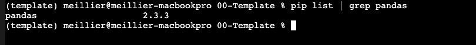

Verify Kernel registration


```bash
jupyter kernelspec list
```
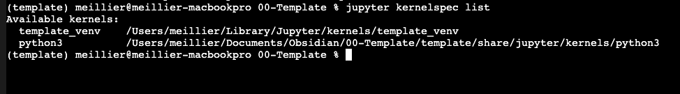


To exit:
```bash
deactivate
```

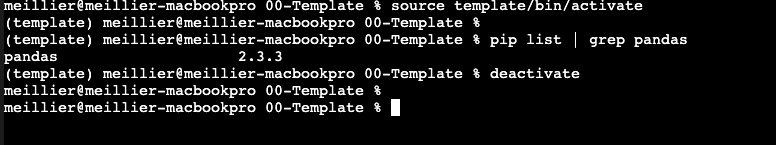

Steps taken resolve execution issues
Here is the summarized, chronological sequence of steps we took to establish a stable, virtual-environment-backed JupyMD setup:

---

### 🛠️ JupyMD Troubleshooting & Setup Guide

This guide assumes your project files are in a folder named `00-Template` and your virtual environment is named `template`.

### Phase 1: Establish & Configure the Python Virtual Environment

This phase isolates your project dependencies and ensures the required tools are installed.

1. **Create and Activate the Virtual Environment (Venv):**
    
    - Navigate to your project directory (`00-Template`).
        
    - Create the environment: `python3 -m venv template`
        
    - **Fix Permissions (Crucial):** If activation fails with "permission denied," grant execute permission: `chmod +x template/bin/activate`
        
    - Activate the environment: `source template/bin/activate`
        
2. **Install Required Packages:**
    
    - While the venv is **active**, install the core tools and data science libraries. The final fix involved a clean reinstall:
        
        Bash
        
        ```
        pip uninstall -y jupytext ipykernel notebook jupyterlab
        pip install jupytext ipykernel notebook jupyterlab pandas numpy
        ```
        
3. **Register the Venv as a Jupyter Kernel:**
    
    - Still with the venv **active**, register a stable kernel name. This is what JupyMD will look for:
        
        Bash
        
        ```
        python3 -m ipykernel install --user --name=**template_venv** --display-name "Template Project VEnv"
        ```
        
4. **Get the Absolute Path:**
    
    - Get the full path to the Python executable inside your venv (used in JupyMD settings):
        
        Bash
        
        ```
        which python
        ```
        
        _Example:_ `/Users/meillier/Documents/Obsidian/00-Template/template/bin/python`
        

---

### Phase 2: Configure the Obsidian Plugin & Note

This phase links the environment and sets up the correct sync protocol.

1. **Configure JupyMD Plugin Settings (Critical Step):**
    
    - Go to **Settings** -> **Community plugins** -> **JupyMD**.
        
    - Set the **Python interpreter** field to the **absolute path** found in Step 4 of Phase 1. (e.g., `/Users/meillier/.../template/bin/python`)
        
    - Set **Bidirectional sync** to **OFF** to prevent the `.ipynb` file from overwriting the Markdown code blocks.
        
2. **Configure Note Frontmatter:**
    
    - Open your Markdown note (`Template.md`) and switch to **Source Mode**.
        
    - Add the following YAML block at the absolute top of the file, ensuring the `name` exactly matches the kernel registered in Step 3 of Phase 1:
        
        YAML
        
        ```
        ---
        jupyter:
          jupytext:
            formats: ipynb,md
            kernelspec:
              name: **template_venv**
              display_name: Template Project VEnv
        ---
        ```
        

---

### Phase 3: Final Execution and Verification

1. **Restart Obsidian:** Fully close and reopen Obsidian for the plugin settings to take effect.
    
2. **Delete the old `.ipynb` file** (if it exists).
    
3. **Create the new linked notebook:** Open the Command Palette (`Ctrl+P`) and run the command **`JupyMD: Create Jupyter notebook from note`**.
    
4. **Test:** Execute a code block using the `python` language tag. It should now successfully run and find your installed libraries like `pandas`.
5. 
---

## gcloud in Jupyter notebook Cells

In a Jupyter Notebook cell running a Python kernel, prefixing any command with an exclamation mark (`!`) tells the interpreter to run that command in the **underlying operating system shell** (Bash, Zsh, etc.) instead of as Python code.


```python
!gcloud auth list
```


```python
import subprocess

# This command will use the system shell to execute the string
# Note: shell=True should be used cautiously
subprocess.run("gcloud auth list", shell=True)
```

Open ipynb in Jupyter

```bash
source template/bin/activate
jupyter notebook
```

```python
!gcloud auth list
```

A browser window/tab opens with jupyter:
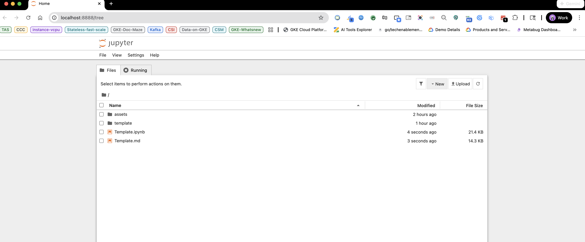

open teh ipynb notebook:
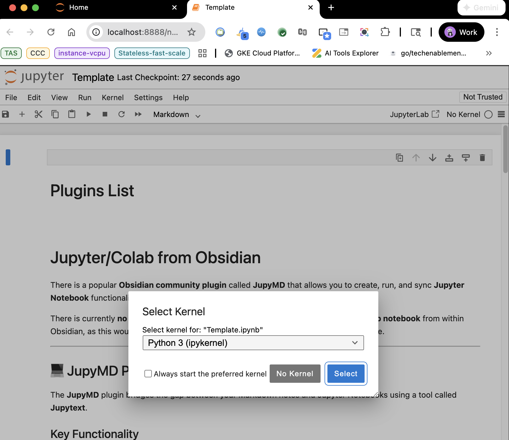

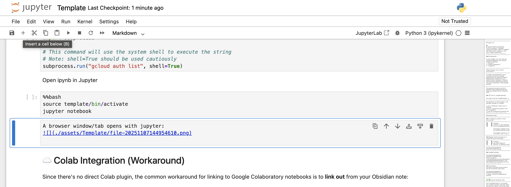

Create a new cell and run:


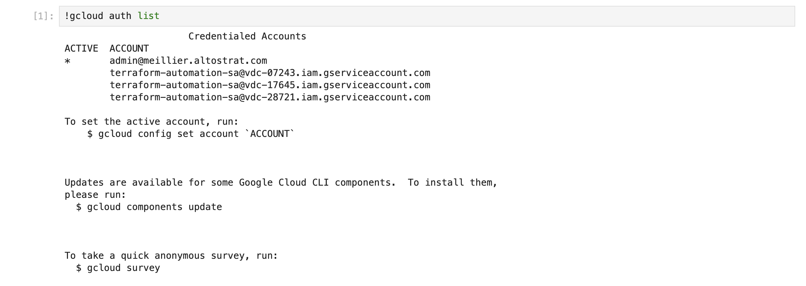


but in obsidian via JupyMD:
```python
!glcoud auth list
```


one has to use subprocess:

```python
import subprocess
import shlex

# Define the command string
command_str = "gcloud auth list"

# Split the command string into a list of arguments
command_list = shlex.split(command_str)

# Execute the command and capture output
try:
    result = subprocess.run(
        command_list,
        capture_output=True,
        text=True,
        check=True
    )
    # Print the gcloud output
    print("--- Gcloud Output ---")
    print(result.stdout)

except subprocess.CalledProcessError as e:
    print(f"Error running gcloud command: {e}")
    # Print the error output
    print(e.stderr)
```

which when executed returns:
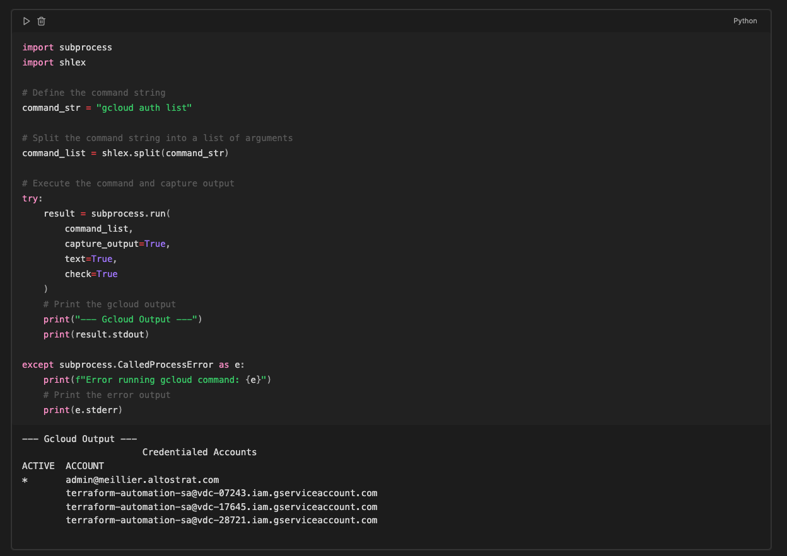
#### gcloud wrapper function:

```python
import subprocess
import shlex

def g(command_str, silent_error=False):
    """
    A simple wrapper function to execute gcloud or any shell command
    from a Jupyter-like environment (like JupyMD).

    This function automatically splits the command string and uses 
    Python's subprocess module for robust execution and output capture.

    Args:
        command_str (str): The full command string to execute (e.g., "gcloud auth list").
        silent_error (bool): If True, suppresses error traceback/output and only prints 
                             the standard error message. Useful for commands that might fail 
                             but shouldn't stop the notebook.

    Returns:
        str: The standard output (stdout) of the command, or None if the command fails.
    """
    # 1. Split the command string safely into a list of arguments
    # This handles spaces within quotes correctly.
    try:
        command_list = shlex.split(command_str)
    except Exception as e:
        print(f"Error splitting command: {e}")
        return None

    # 2. Execute the command
    try:
        result = subprocess.run(
            command_list,
            capture_output=True,
            text=True,
            check=True  # Raises CalledProcessError for non-zero exit codes
        )
        
        # 3. Print the output and return it
        print(result.stdout.strip())
        #return result.stdout.strip()

    except subprocess.CalledProcessError as e:
        error_output = e.stderr.strip()
        
        if not silent_error:
            print(f"--- GCLOUD COMMAND FAILED ---")
            print(f"Command: {command_str}")
            print(f"Return Code: {e.returncode}")
            print(f"Error: {error_output}")
        else:
            print(f"Error (Return Code {e.returncode}): {error_output}")
            
        return None
    
    except FileNotFoundError:
        print("ERROR: The 'gcloud' executable was not found. Ensure gcloud CLI is installed and in your system PATH.")
        return None
```

```python
g("gcloud auth list")
```

this will allow running the gcloud command:
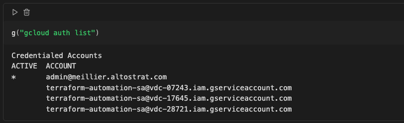
### g() and get()


execute_gcloud()

```python
import subprocess
import shlex

def _execute_gcloud(command_str, silent_error=False):
    """
    INTERNAL CORE FUNCTION: Executes the shell command using subprocess.
    This function is ALWAYS silent regarding stdout, only returning the result.
    """
    try:
        command_list = shlex.split(command_str)
    except Exception:
        print(f"Error splitting command: {command_str}")
        return None, None # Returns (output, error)

    try:
        result = subprocess.run(
            command_list,
            capture_output=True,
            text=True,
            check=True
        )
        
        # Returns the output string and None for error
        return result.stdout.strip(), None

    except subprocess.CalledProcessError as e:
        # Returns None for output and the error string
        error_output = e.stderr.strip()
        
        if not silent_error:
            print(f"--- GCLOUD COMMAND FAILED (Return Code {e.returncode}) ---")
            print(f"Command: {command_str}")
            print(f"Error Output: {error_output}")
        return None, error_output # Return None for stdout
    
    except FileNotFoundError:
        print("ERROR: The 'gcloud' executable was not found. Ensure gcloud CLI is installed.")
        return None, "gcloud executable not found"

```

g()

```python
def g(command_str, silent_error=False):
    """
    g() - SIMPLE EXECUTION (Prints Output)
    Runs a gcloud command and prints the output once. Does NOT return a capturable value.
    """
    # Calls the executor and asks for the output (return_output=True is unnecessary now)
    output, error = _execute_gcloud(command_str, silent_error=silent_error)
    
    if output is not None:
        print(output)
        
    # Always returns None to suppress the notebook's automatic output display
    return None 
```

get()

```python
def get(command_str, silent_error=False):
    """
    get() - ASSIGNMENT (Silent Capture)
    Runs a gcloud command and returns the output string for assignment. Prints nothing on success.
    """
    # Calls the executor
    output, error = _execute_gcloud(command_str, silent_error=silent_error)
    
    # Returns the clean output string if successful, otherwise None
    return output

```


in bash would do:
```bash
REGION_NAME=$(gcloud config get-value compute/region)
```

with our function:


```python
g("gcloud config get-value compute/region")
```

```python
region_name = get("gcloud config get-value compute/region")
print(region_name)
```


when executed it gives us the expected behavior of command output (`print(output)`) vs value extraction (`return(output)`):
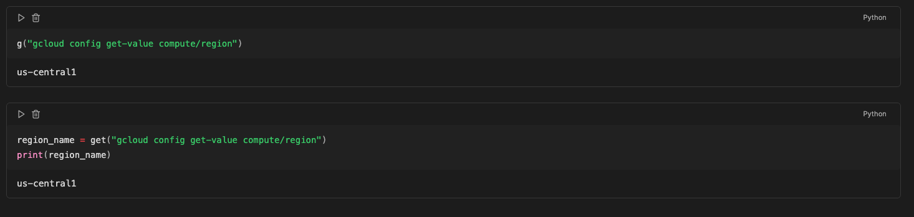


## ☁️ Colab Integration (Workaround)

Since there's no direct Colab plugin, the common workaround for linking to Google Colaboratory notebooks is to **link out** from your Obsidian note:

- **Markdown Link:** You can simply create a Markdown link in your note to the Colab notebook's URL: `[My Project Colab Notebook](https://colab.research.google.com/drive/...)`
    
- **iFrame (Limited):** Some users have explored using an `<iframe>` in Obsidian to embed a preview of a public notebook (often via services like Binder or simply the Colab share link). However, this method is usually limited to **viewing** and does **not** allow for running or editing the code interactively within Obsidian.

# Custom CSS Configurations

## 🛠️ Resize Edit Area with Window Size

This method doesn't require a new community plugin and will make the editable text area width responsive to the size of its containing pane, or the entire window if the pane is maximized. 

### 1. Create the CSS Snippet File

1. Navigate to your Obsidian vault's settings: **Settings** (Gear icon) → **Appearance**.
    
2. Scroll down to the **CSS Snippets** section and click the folder icon to open the snippets folder.
    
3. In that folder (e.g., `.obsidian/snippets/`), create a new file and name it something like `auto-resize-editor.css`.
    
4. Paste the following code into the file and save it:


CSS

```
/*
  This snippet overrides the default fixed 'readable line length' 
  width (usually 700px or similar) and makes it a percentage 
  of the available space.
*/

body {
  /* This is the global variable for the note content width */
  --file-line-width: 95%; /* Use 95% or 100% for full width */
}

/* Ensure the editor and preview respect the new width */
.markdown-source-view.is-readable-line-width .CodeMirror,
.markdown-preview-view.is-readable-line-width .markdown-preview-sizer {
  max-width: var(--file-line-width) !important;
  width: var(--file-line-width) !important;
}

/* Optional: Center the text when using less than 100% */
.markdown-source-view.is-readable-line-length,
.markdown-preview-view.is-readable-line-length {
  margin: 0 auto;
}
```

### 2. Activate the Snippet

1. Go back to **Obsidian Settings** → **Appearance**.
    
2. In the **CSS Snippets** section, click the **Refresh** button next to the folder icon.
    
3. Your new snippet (`auto-resize-editor`) should appear in the list.
    
4. **Toggle the switch to ON** to activate the snippet.


### 3. Ensure "Readable Line Length" is ON

For this CSS to correctly override the line length, the built-in Obsidian setting **must be enabled**:

1. Go to **Obsidian Settings** → **Editor**.
    
2. Ensure that the setting **Readable line length** is **Toggled ON**.


With this CSS snippet, the width of your editing area will now automatically adjust as you resize the Obsidian window or the note pane, based on the percentage you set (e.g., `95%`).
